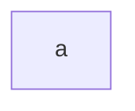
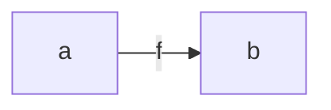
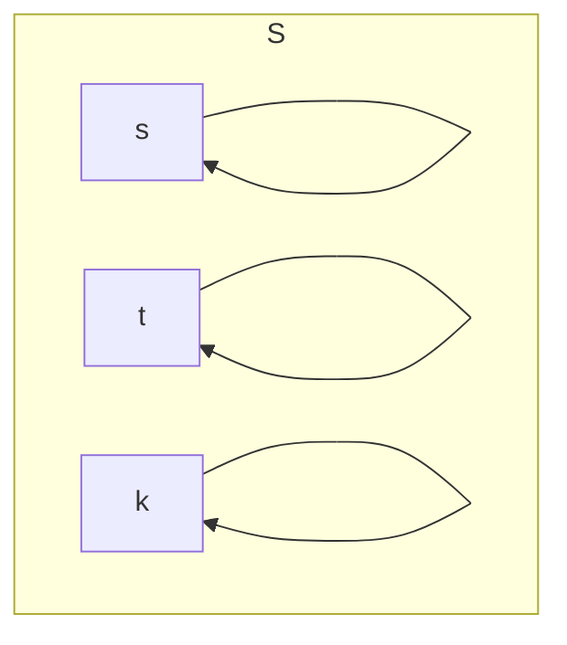
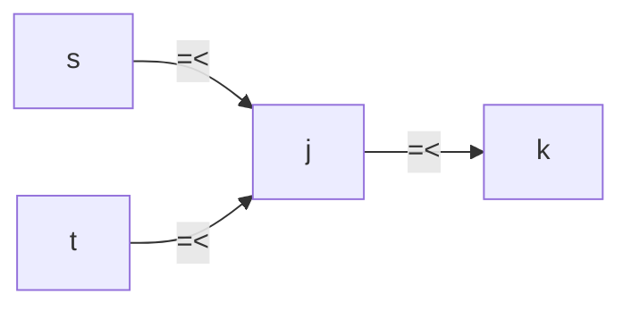

# Notation
a is element

f is mapping element to element ( |-> )

# Order
- 反射的であるということ

∀s∈S, s |-> s

- 順序集合の上限、下限
    - 上限
        - s,t,k,j∈S
        - (s ≤ j) ∧ (t ≤ j)
        - ∀k, (s≤k ∧ t≤k) → j≤k
    - 下限
        - jの逆

